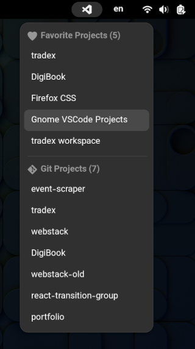

<div align="center">
  <h1>VSCode Projects Gnome Extension</h1>
  <p><b>Easily open your VSCode projects from gnome-shell</b></p>
  <a href="https://extensions.gnome.org">
    
  </a>
</div>

This extension simply allows you to open the projects from [VSCode](https://code.visualstudio.com) [Project Manager extension](https://github.com/alefragnani/vscode-project-manager) in menu on the gnome-shell toolbar.



# Installation

## Recommended

Install from [GNOME Shell Extensions](https://extensions.gnome.org) website to get latest version.

## Manual

1. Clone the repo

   ```sh
   git clone https://github.com/ahmafi/gnome-vscode-projects
   ```

2. Install the extension (it will use `gnome-extensions` to install into `~/.local/share/gnome-shell/extensions`)

   ```sh
   cd gnome-vscode-projects
   make install
   ```

   **Or** do it manually

   ```sh
   cd gnome-vscode-projects
   mkdir ~/.local/share/gnome-shell/extension/vscodeprojects@ahmafi.ir
   cp -r src/* ~/.local/share/gnome-shell/extension/vscodeprojects@ahmafi.ir
   ```

3. Restart the gnome-shell

   - **Wayland**: Logout and login.

   - **X11**: Press `Alt+F2` and run `r` to restart. Or logout and login.

4. Enable the extension:
   ```
   gnome-extensions enable vscodeprojects@ahmafi.ir
   ```
   You can also enable it in GUI from the [Extension Manager](https://github.com/mjakeman/extension-manager) app.

# TODO

- [ ] Different button for opening the project in a new window
- [ ] Show project tags
- [ ] View as tags
- [ ] Filter by tags
- [ ] Sort by Path, Recent, Saved
- [ ] Support VSCodium
- [ ] Allow configuring the executable

# Development

Copy the source files into extensions directory

```
make install
```

Enable the extension (Only for the first time)

```
gnome-extensions enable vscodeprojects@ahmafi.ir
```

Run a wayland nested session

```
make run
```

If you are using X11, or for more details see [here](https://gjs.guide/extensions/development/creating.html#enabling-the-extension).

# Shout-outs

Thanks to all open source contributors, especially the contributors to [GNOME](https://www.gnome.org), [VSCode](https://code.visualstudio.com) and [Project Manager extension](https://github.com/alefragnani/vscode-project-manager).

Thanks to [svgrepo](https://www.svgrepo.com) for a huge repository of great icons.
